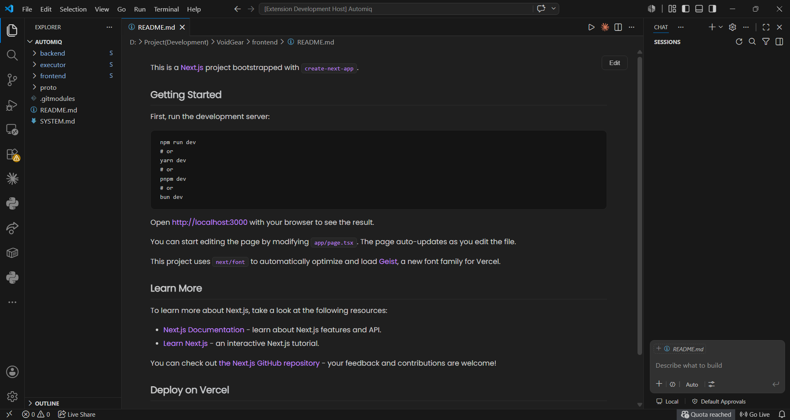
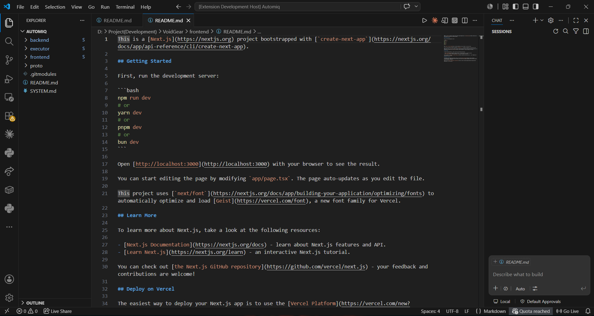

  

  # MarkView

  **A beautiful GitHub-style Markdown viewer and editor for Visual Studio Code.**

---

## 📖 Overview

MarkView transforms standard Markdown files into a beautiful, GitHub-style reading experience directly inside Visual Studio Code. 

Instead of viewing raw Markdown alongside a split preview, you can open your `.md` files in a clean, rendered interface that feels like reading documentation natively on GitHub or modern knowledge-base tools.

## ✨ Features

- **GitHub-Style Rendering:** Clean, familiar styling for all standard Markdown syntax.
- **In-Editor Viewing:** Opens files directly inside the editor without requiring a separate preview tab.
- **Seamless Editing:** A floating **Edit** button allows you to instantly switch back to the source code.
- **Responsive Layout:** Centered content that adapts to your editor's width for optimal readability.
- **Native Integration:** Blends flawlessly with your active VS Code themes.
- **Live Updates:** Previews update automatically as the file changes.
- **Lightweight & Fast:** Built for performance with minimal overhead.

## 📸 Screenshots

### Rendered Markdown View

### Editing Mode

## 🚀 Getting Started

To start using MarkView:

1. Open any Markdown file (e.g., `README.md`).
2. **Right-Click** anywhere in the editor or on the file tab.
3. Select **Reopen With...**
4. Choose **MarkView**.

> **Pro Tip:** You can configure MarkView as your default editor for all `.md` files to permanently streamline your reading experience.

## 🛠 Supported Markdown Elements

MarkView fully supports standard Markdown syntax, including:
- Headers (H1-H6)
- Ordered and Unordered Lists
- Tables
- Blockquotes
- Code Blocks 
- Links and Images
- Task Lists / Checklists
- Horizontal Rules
- Inline Code

## 🤔 Why MarkView?

Most Markdown previews in VS Code feel disjointed—often requiring separate windows or split editors that clutter your workspace. MarkView was built to provide a reading experience that feels natural:

- Open documentation without distractions.
- Keep your workspace clean with a single-tab experience.
- Switch seamlessly between reading and editing with a single click.

It is the perfect companion for viewing `README.md` files, project documentation, architecture notes, and personal knowledge bases.

## 🗺 Roadmap

We are actively working to improve MarkView. Here is what is coming next:

- [ ] Syntax highlighting for code blocks
- [ ] Mermaid diagram support
- [ ] Automated Table of Contents
- [ ] In-preview search functionality
- [ ] Export to HTML/PDF
- [ ] Scroll synchronization between editor and preview
- [ ] Copy button for code blocks
- [ ] Custom theme configurations

## ⚙️ Requirements

- Visual Studio Code **v1.125.0** or later.

## 🐛 Known Issues

- Some advanced GitHub-specific Markdown extensions may not be fully supported yet.
- Opening extremely large Markdown documents may experience slight render delays.

## 🤝 Feedback and Contributing

Found a bug or have a feature request? We'd love to hear from you!
👉 **[Open an Issue on GitHub](https://github.com/Pushpraj-10/MarkView/issues)**

Contributions, ideas, and feedback are always welcome:
1. Fork the repository.
2. Create your feature branch (`git checkout -b feature/AmazingFeature`).
3. Commit your changes (`git commit -m 'Add some AmazingFeature'`).
4. Push to the branch (`git push origin feature/AmazingFeature`).
5. Open a Pull Request.

## 📄 License

This project is licensed under the MIT License - see the LICENSE file for details. © Pushpraj

---

  <em>Built initially for personal use, but I'd love it if you find it useful too! ❤️</em>

